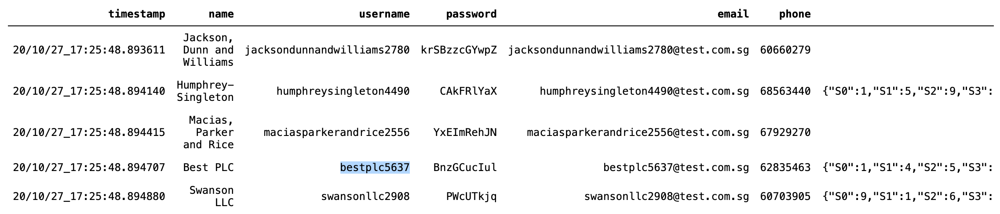

---

## SECTION 1 : PROJECT TITLE
## Intelligent Reservation System


---

## SECTION 2 : Poster
## Intelligent Reservation System


---
## SECTION 3 : EXECUTIVE SUMMARY / PAPER ABSTRACT

In the wake of coronavirus pandemic, social distancing enforcement is a must. Establishments (e.g. shops, offices, clinics, training/education centres, etc.) must operate at reduced capacity to keep patrons adequately apart. Unfavourable lines/crowd may form at the entrance which poses transmission risk. Hence, establishment must accept reservations in order to optimize capacity while ensuring safety as well as saving time for patrons. 

We propose that the reservation be handled by a software agent. The intelligent agent searches and slots patrons into their preferred slot, or to suggest alternative slots. It will send reminder with options to cancel or to change reservation, and act accordingly in real-time to optimize establishment capacity. It may also notify other relevant patrons with request to switch reservation slots in attempt to accommodate other patron's reservation change or cancellation. If this were to be carried out by a human operator, it would be very demanding for the operator in each establishment. 

Agent interacts with patrons in real-time through a chatbot. Interaction may be bidirectional, as the knowledge base (KB) may be provided from establishment (e.g. informational KB or conditional KB; establishment may require patrons to show up with certain dress code, bring certain documents, admittance procedures that must be known beforehand, etc.) – hence, a solution. The solution may be tailored to suit applications in different areas (e.g. hospitality, retail, office, education, healthcare, etc.). 

Every hit (a request: new/change/cancellation/query) could be registered. At the end of a period, a report will be produced. From the report, various analytical and intelligent approaches may be used to understand patron/market behaviour (Knowledge Discovery). Beyond pandemic, the solution may continue to provide business value as it may be configured to original capacity or even an expansion of business. 

---
## SECTION 4 : CREDITS / PROJECT CONTRIBUTION

| Official Full Name  |  Work Items (Who Did What) | Email (Optional) |
| :------------ | :-----------------------|:----------------|
| Januwar Hadi | Rule-based Engine, GA, Database Design |  |
| Rajamanickam Hamsamalini | Chatbot,Django-Chatbot Integration, Database Design | chamsamalini@gmail.com |
| Kevin Chng Jun Yan | Django Backend, Frontend, Database Design | kevinchng@hotmail.com |

---
## SECTION 5 : VIDEO OF SYSTEM MODELLING & USE CASE DEMO

[

---
## SECTION 6 : USER GUIDE TO RUN THE INTEGRATED SYSTEM IN LOCAL MACHINE

In order to run integrated system in local machine, you have to 

1) Setup "ngrok" for securing URL to your localhost server through any NAT or firewall.
2) Enable "Facebook Authentication", "Google Map Platform Authentication" and "Diaglowflow Google Authentication"
3) Install required packages for your backend django

please follow the guidance below to set up the above 3 prerequisite for running our integrated system in local machine
| No | Area  |  Reference |
| :--------- | :--------------------------------|:----------------|
| 1 | Ngrok Activation | [Reference](https://github.com/KevinChngJY/IntelligentReservationSystem/blob/main/Documents/ngrok_activation.md) |
| 2 | Facebook Authentication | [Reference](https://github.com/KevinChngJY/IntelligentReservationSystem/blob/main/Documents/facebook_authentication.md) |
| 3 | Google Map Platform Authentication | [Reference](https://github.com/KevinChngJY/IntelligentReservationSystem/blob/main/Documents/google_map_platform_authentication.md) |
| 4 | Dialogflow – Google Authentication | [Reference](https://github.com/KevinChngJY/IntelligentReservationSystem/blob/main/Documents/dialglowflow_google_authentication.md) |
| 5 | Install Required Packages | [Reference](https://github.com/KevinChngJY/IntelligentReservationSystem/blob/main/Documents/install_django_package.md) |
| 6 | Configure Django Files | [Reference](https://github.com/KevinChngJY/IntelligentReservationSystem/blob/main/Documents/configure_django_file.md) |

Now you have completed all prerequisite,
In your Anaconda prompt,
1) activate the virtual environment "conda activate irs_project"
2) Go to the downloaded path of project code, "cd path_of_your_project_code"
3) run the django server, "python manage.py runserver" <br>
 <br>
 
 
---
## SECTION 7 : USER GUIDE TO RUN RULES ENGINE
Other than running the integrated system in local host, you are also allowed to merely run our rule engine for you to understand the mechanism behind our scheduling process.

#### Rules Engine

Rules and its attribute classes are contained in **ira.py**. 
Two classes that may be used are: 
1.  `Agent` class that handles all interactions with rules.
2.  `HouseKeeping` class that handles maintenance of resources (e.g. database entries)

Configuration file **config.ini** has link to database (and its tables) as well as rules builder. 
As a text file, It may be modified to: 
1. Configure custom rules or rules order, and
2. Path to link to different database. 

In addition, there is **util.py** that is useful for initialization and simulation. 

Dependencies: Install packages as listed in **requirements.txt** to either virtual environment or what not. Type line below in command line to create *Anaconda* virtual environment as well as installing required packages. Replace `<env>` with your desired virtual environment name. 

`$ conda create --name <env> --file requirements.txt -y`

Once installation completed, activate the virtual environment. 

`$ conda activate <env>`


#### A. Initialization

In addition to **ira.py** module and configuration file **config.ini**, there must be a database file. 
To generate database file run code below:
```
> import util
>
> util.init_db()
```
This generates **dummy.db** database file, and six tables associated to rules engine.  
This also generates dummy patrons (default is 100 patrons) and establishments (default 5). 
Default database, table names and number of entries may be overridden.

To create simulated data, run code below from **util.py** module. 
Do take note that the database configuration must match **config.ini** file (if default names are overridden) as it will actually invoke `Agent` to create entries in database. See section Z (under DB) for more explanation. 
```
> util.create_dummy_appointments()
```
This will populate *query* and *reservation* tables with random entries up to 3 days. 

#### B. Create New Reservation

In order to make reservation, patron and establishment identifier must first be obtained. 
```
> util.load_table('dummy_pat', 'dummy.db')
```


```
> util.load_table('dummy_est', 'dummy.db')
```


Arguments *dummy_pat*, *dummy_est* and *dummy.db* are default patron table name and default database name. 

From patron and establishment, `Agent` can be invoked. 
```
> from ira import Agent
>
> session = '001'
> intent = 'NewReservation'
> patron = 'veronicarodriguez750602'
> establishment = 'bestplc5637'
```
Session is arbitrary identifier that is unique for each conversation with **ira.py**. A conversation may have series of interactions with same session. 
```
> time_in = '20/11/11_12:34'
> n_person = '2'
> response = Agent(session, intent, patron, establishment, time_in=time_in, n_person=n_person).check_rules()
> print(response[1])
```


As IRA offers options, patron chooses one as selection.

```
> selection = '20/11/11_12:30'
> response = Agent(session, intent, patron, establishment, selection=selection).check_rules()
> print(response[1])
```


As IRA returns tuple, the confirmation message is at index 1. 

#### C. Change Existing Reservation


#### Z. Rules Builder

Configuration file **config.ini** has six sections: 
* DB
Link (relative path from **ira.py**) to database file, and how each table is name.
* Information
FAQ (or otherwise business information) for chatbot knowledge base
* NewReservation
Intent name and rule sequence for new reservation
* ChangeReservation
Intent name and rule sequence for change of existing reservation
* CancelReservation
Intent name and rule sequence for cancellation of existing reservation
* CheckReservation
Intent name and rule for checking of reservation history

The last four sections enable a separation of business logic from system. 
List of rules that business user may choose to build a sequence is explained below: 


---
## SECTION 8 : PROJECT REPORT / PAPER

[Power Point Slide](https://github.com/KevinChngJY/IntelligentReservationSystem/blob/main/Documents/Intelligent%20reservation%20agent%20-%20Bot.pdf)

