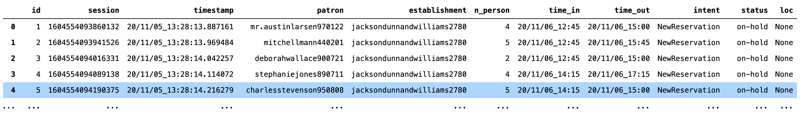
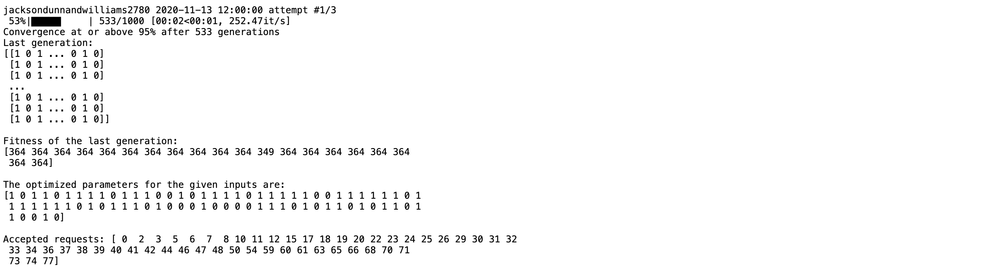
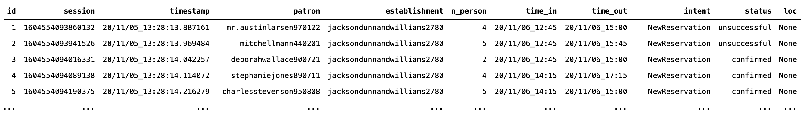
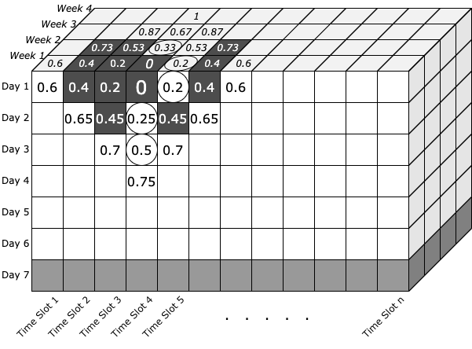

---

## SECTION 1 : PROJECT TITLE
## Intelligent Reservation System


---
## SECTION 2 : EXECUTIVE SUMMARY / PAPER ABSTRACT


---
## SECTION 3 : CREDITS / PROJECT CONTRIBUTION

| Official Full Name  | Student Id | Work Items (Who Did What) | Email (Optional) |
| :------------ |:----------------| :-----|:----------------|
| Januwar Hadi |  |Rule-based Engine, GA, Database Design |  |
| Rajamanickam Hamsamalini |  |Chatbot,Django-Chatbot Integration, Database Design | |
| Kevin Chng Jun Yan |   |Django Backend, Frontend, Database Design | kevinchng@hotmail.com |

---
## SECTION 4 : VIDEO OF SYSTEM MODELLING & USE CASE DEMO

[

---
## SECTION 5 : USER GUIDE


### To run the system in local machine
### Ngrok Activation : [a link](https://github.com/user/repo/blob/branch/ngrok.md)

### Facebook Authentication

### Google Map Platform Authentication

### Diaglogflow Authentication

### Rules Engine

Rules and its attribute classes are contained in **ira.py**. 
Two classes that may be used are: 
1.  `Agent` class that handles all interactions with rules.
2.  `HouseKeeping` class that handles maintenance of resources (e.g. database entries)

Configuration file **config.ini** has link to database (and its tables) as well as rules builder. 
As a text file, It may be modified to: 
1. Configure custom rules or rules order, and
2. Path to link to different database. 

In addition, there is **util.py** that is useful for initialization and simulation. 

Dependencies: Install packages as listed in **rules_requirements.txt** (to preferably Anaconda virtual environment). Replace `<env>` with your desired virtual environment name. 

`$ conda create --name <env> --file rules_requirements.txt -y`

Once installation completed, activate the virtual environment to try out subsequent demonstration in either jupyter-lab (install separately), IDE or python shell. 

`$ conda activate <env>`

Optional: To install jupyter-lab from virtual environment.

`(<env>)$ conda install jupyterlab -y`

Rules Engine Sections: 
1. Section B, C, D cover reservation relevant to exclusive scenarios (e.g. restaurant, where group of patrons is allocated exclusive space for their own group).  
2. Section D, E, F cover reservation relevant to inclusive situation (e.g. mall or other large communal space, where as many patrons may be admitted as long as within capacity threshold as any given time).  
3. Section G, H, I: Reporting (Knowledge Discovery)
4. Section J: How to generate simulated data
5. Section K: Configuration and rules builder
6. Section L: Rules and actions library

Code for this demo is available in **test.ipynb**. 

`(<env>)$ jupyter-lab test.ipynb`


#### A. Initialization/Quickstart

In addition to **ira.py** module and configuration file **config.ini**, there must be a database file. 

As a starter, there is **dummy.db** for the purpose of self-help demonstration and incremental integration to chatbot.
 
In order to do anything with a reservation, *patron* and *establishment* identifiers must first be obtained. 
```
> util.load_table('dummy_pat', 'dummy.db')
```


```
> util.load_table('dummy_est', 'dummy.db')
```


Arguments *dummy_pat*, *dummy_est* and *dummy.db* are default patron table name and default database name. 

Once patron and establishment are known, `Agent` can be invoked. Argument *intent* must match the section title in **config.ini**. IRA will execute according to rule sequence in that section. 


#### B. Create New Reservation

Choose establishment whose sublocs is NOT empty (-). Sublocs is akin to restaurant table or lounge premise which groups are exclusive to one another.  
It is stored as json string in the database.  
```
> from ira import Agent
>
> session = '001'
> intent = 'NewReservation'
> patron = 'veronicarodriguez750602'
> establishment = 'bestplc5637'
```
Session (*session*) is arbitrary identifier that is unique for each conversation with **ira.py**. A conversation may have series of interactions with same session. Keyword arguments *time_in* and *n_person* are to indicate what time and number of guests patron would like the reservation for.  
**IMPORTANT:** Please ensure that the **time_in** is a future time (preferably few days in future and within business hours as default rules sequence has such requirements). 
In any case where the `response` deviates from what shown in this document, refer to section K and L for explanation.  

```
> time_in = '20/11/11_12:34'
> n_person = '2'
> response = Agent(session, intent, patron, establishment, time_in=time_in, n_person=n_person).check_rules()
> print(response[1])
```


As IRA offers options, patron chooses one as selection.

```
> selection = '20/11/11_12:30'
> response = Agent(session, intent, patron, establishment, selection=selection).check_rules()
> print(response[1])
```


As IRA returns tuple, the confirmation message is at index 1. 


#### C. Change Existing Reservation

Changing reservation requires matching intent as in **config.ini**. Default is *ChangeReservation*. 
```
> session = '002'
> intent = 'ChangeReservation'
> patron = 'veronicarodriguez750602'
> establishment = 'bestplc5637'
>
> response = Agent(session, intent, patron, establishment).check_rules()
> print(response[1])
```


Patrons would choose which existing reservation he/she would like to change. Option (1) is the one created from previous step (section B). Pass the selection as keyword argument *selection*.   
```
> selection1 = '20/11/11_12:30'
> response = Agent(session, intent, patron, establishment, selection=selection1).check_rules()
> print(response[1])
```


IRA asks time and number of persons the reservation would need to be changed for. Pass them as respective keyword arguments. 
```
> time_in = '20/11/11_13:00'
> n_person = '5'
> response = Agent(session, intent, patron, establishment, time_in=time_in, n_person=n_person).check_rules()
> print(response[1])
```


IRA responds with list of time slots, and patron to choose from the proposed list. 

```
> selection2 = '20/11/11_13:00'
> response = Agent(session, intent, patron, establishment, selection=selection2).check_rules()
> print(response[1])
```


IRA responds with success message. 


#### D. Cancel Existing Reservation

Cancelling reservation requires matching intent as in **config.ini**. Default is *CancelReservation*.
```
> session = '003'
> intent = 'CancelReservation'
> patron = 'veronicarodriguez750602'
> establishment = 'bestplc5637'
> response = Agent(session, intent, patron, establishment).check_rules()
> print(response[1])
```


IRA responds with list of existing reservations. Patron is to choose which to cancel.
```
selection = '20/11/11_13:00'
response = Agent(session, intent, patron, establishment, selection=selection).check_rules()
print(response[1])
```


IRA confirms that reservation has been successfully cancelled. 


#### E. Waitlist Reservation

Establishments without sublocs accept ballots at least one day in advance. In order to ballot, use *establishment* whose sublocs is empty (-). See establishment table in section A.  
```
> session = '011'
> intent = 'NewReservation'
> patron = 'veronicarodriguez750602'
> establishment = 'maciasparkerandrice2556'
> 
> time_in = '20/11/12_12:00'
> n_person = '2'
> response = Agent(session, intent, patron, establishment, time_in=time_in, n_person=n_person).check_rules()
> print(response[1])
```


IRA responds with suggestion that fits into establishment's one time slot. 
```
selection = '20/11/12_12:00'
response = Agent(session, intent, patron, establishment, selection=selection).check_rules()
print(response[1])
```


As patron confirms with *selection*, IRA sends receipt message for acceptance of request. See section G for detail on how the request is confirmed or rejected. 

Alternatively, patron may indicate *time_out* for a request for block of multiple and continuous time slots instead of just one. 
```
> time_in = '20/11/12_12:05'
> time_out = '20/11/12_15:20'
> n_person = '5'
> 
> response = Agent(session, intent, patron, establishment, time_in=time_in, time_out=time_out, n_person=n_person).check_rules()
> print(response[1])
```


```
> selection = '20/11/12_12:30'
> response = Agent(session, intent, patron, establishment, selection=selection).check_rules()
> print(response[1])
```


#### F. Waitlist Reservation Change and Cancellation

Default rule sequence does not allow change of waitlisted reservation. Cancellation, however, is allowed.  


#### G. Waitlist Reservation Confirmation

Once a successful request is submitted, waitlisted request status is indicated as *on-hold*. 
```
> util.load_table('dummy_rsv', 'dummy.db')
```


In order to handle waitlisted request, a service must be subscribed to run periodically (daily). It is for an algorithm to assign each waitlisted request a confirmation or rejection. This is where `HouseKeeping` class is useful. 
```
> from ira import HouseKeeping
> 
> HouseKeeping().genetic_algorithm_check(all_days=True, plot=True)
```



If *all_days* set to `True`, the algorithm will run for all entries in the reservation table. If `False`, it will only run for the next business day. Default `False`. 
If *plot* is set to `True`, it will print the progress and plot fitness and other metrics. Default `False`. 
These metrics will be stored in reservation report database, default *dummy_rsv_report*. 
Refer to section H for more details. 
```
> util.load_table('dummy_rsv', 'dummy.db')
```


If the algorithm finds solution, each request will be reassigned from *on-hold* to as either *confirmed* or *unsuccessful*. Otherwise, all reservation on that day will be assigned as *walk-in*. 


#### H. Reservation Report

Running Reservation `HouseKeeping().genetic_algorithm_check()` will automatically generate reservation report for reservations whose status is `on-hold` -- the inclusive scenario. 
Report may also be generated for exclusive scenario. 
```
> HouseKeeping().linear_check(all_days=True)
```
If *all_days* set to `True`, the algorithm will run for all entries in the reservation table. If `False`, it will only run for the next business day. Default `False`. 

The report is stored in reservation report table
```
> util.load_table('dummy_rsv_report', 'dummy.db')
```


Source *ga* indicates that the report is generated by `HouseKeeping().genetic_algorithm_check()`, *sl* indicates `HouseKeeping().linear_check()`.
Entries in *hourly* column are hourly outlook, in json string format. Each may be tabulated as shown below.   


#### I. Query Report & Reservation Status Check

In order to gain insight of patron queries, run code below:
```
> HouseKeeping().summarize_query(plot=True)
```
If *plot* set to `True`, it prints progress. Default `False`. 
Below is sample of what query report looks like. 

```
> util.load_table('dummy_qry_report', 'dummy.db')
```


*n_total* indicates the number of queries an establishment receive in a day. 
Values in *DuplicateExist*, *OversizedGroup*, *PlaceNotAvail*, and so fort indicates percentage. 
The percentage out of *n_total* that the patron query terminates at. 
The termination is last Action by IRA. For more details of Action, see section L. 

For example, for establishment *bestplc5637* reporting period *20/11/06*, out of total *515* patron queries, *39.029126213592235* percents terminates at *OversizedGroup*. 
Meaning, on Nov 6 around 201 inquires (~39%) to reserve for a group greater than allowed group size.    

Patrons may use *CheckReservation* intent to check for their reservation status.  
```
> session = '021'
> intent = 'CheckReservation'
> patron = 'brittanymartinez120418'
> establishment = 'jacksondunnandwilliams2780'
> 
> response = Agent(session, intent, patron, establishment).check_rules()
> print(response[1])
```


IRA would give an insight in case the waitlisted reservation eventually becomes *unsuccessful*. It advises patron the alternatives time for walk-in.  


#### J. Simulation Data

To generate new database file run code below:
```
> import util
>
> util.init_db()
```
This generates **dummy.db** database file, and six tables associated to rules engine.  
This also generates dummy patrons (default is 100 patrons) and establishments (default 5). 

Default database, table names and number of entries may otherwise be overridden, shown below. 
```
> util.init_db(db='dummy.db',                     # database name
               tn_pat='dummy_pat',                # table name patron
               tn_est='dummy_est',                # table name establishment
               tn_qry='dummy_qry',                # table name query
               tn_rsv='dummy_rsv',                # table name reservation
               tn_qry_report='dummy_qry_report',  # table name query report
               tn_rsv_report='dummy_rsv_report',  # table name reservation report
               n_establishment=5,                 # number of dummy establishment, enter 0 if not needed
               n_patron=100,                      # number of dummy patron, enter 0 if not needed
             )
```
To create simulated data, run code below from **util.py** module. This will populate *query* and *reservation* tables with random entries up to 3 days.
```
> util.create_dummy_appointments(n_day=3, tn_pat='dummy_pat', tn_est='dummy_est')
``` 

The database may also be otherwise generated by Django or other web framework that has built-in database manager. 
As such, table column names and data type (all string) must be identical to what **dummy.db** uses.  
Do take note that the database configuration must also match **config.ini** file (if default names are overridden) as it will actually invoke `Agent` to create entries in database. 
See section K (under DB) for more explanation. 


#### K. Rules Builder

Configuration file **config.ini** has six segments. First two namely: 
* DB: Link (relative path from **ira.py**) to database file, and how each table is named.
* Information: FAQ (or otherwise business information) for chatbot knowledge base. This may not be necessary as it would be handled primarily by Dialogflow. 

The next four below enable a separation of business logic from system, for the benefit of business user to self-help with rules customization. 
* NewReservation: Intent name and rule sequence for new reservation
* ChangeReservation: Intent name and rule sequence for change of existing reservation
* CancelReservation: Intent name and rule sequence for cancellation of existing reservation
* CheckReservation: Intent name and rule for checking of reservation history

Sample section of **config.ini**. 
```
[CancelReservation]
1 = IsTimeout?Timeout:
2 = IsUpcomingExist?ListUpcoming:UpcomingNotExist
3 = SlotNotSelected?SelectionNotValid:
4 = IsValidSelection?CancelSuccess:InputNotValid
```
`[CancelReservation]` is segment (intent) name. `Agent` looks into this segment when *CancelReservation* string passed as intent. 
For line `2 = IsUpcomingExist?ListUpcoming:UpcomingNotExist`, number `2` is rule sequence number, rule sequence must start from `1` and be sequential thereafter. 
`IsUpcomingExist` is a Rule, which if equates to `True`, `ListUpcoming` Action will be returned, otherwise `UpcomingNotExist` is returned. 
In case where there is no Action is indicated after a Rule is executed, next in sequence will execute. 
Alternatively, an integer in place of an Action instructs the execution to jump as many as integer number of rule ahead. 

List of rules and actions is explained in section L. 


#### L. Rules and Action Library

List of Rules and Actions that business user may choose to build a sequence is explained below: 

##### Rules: 

1. WithinBookableWindow. Returns `True` if `time_in` is: 
    * Within establishment's operating hours (refer to establishment table *open_time* and *close_time*) and operating days (*open_days*)
    * Greater or equal to days in advance (*days_in_advance*)

2. WithinCapacity. `True` if total number of persons from already confirmed reservations and `n_person` at 'time_in` do not exceed establishment's *max_cap*.  

3. WithinGroupSize. `True` if `n_person` is equal or less than establishment's maximum allowable groupsize, *max_group_size*. 

4. IsDuplicateExist. `True` if patron already have reservation at same `time_in` with same establishment. 

5. SlotsAvailable. `True` if search algorithm is successful to find solution. IRA uses `Searcher` class in **ira.py** to find list of proposed slots that is under cost threshold, *thres*. IRA looks for every establishment's *sublocs* (e.g. restaurant table) if any is available. List is sorted cost-wise, from low to high. Users do not need to invoke `Searcher` class manually. Success is stored in `Searcher`'s `is_avail` property, which is `True` if proposed list is not empty. Essentially, if search algorithm is able to propose slots based on patron `time_in`, this returns `True`. 

6. SlotAvailable. Similar to *SlotsAvailable*, except that this account for `n_person`. In order to avoid assigning large allocation to small request (e.g. a table that can seat 5 to patron of 1), this rule restricts such allocation by factor of 2. As such, `Searcher`'s  `is_clashed` property is flagged as `False` and this rule returns `False` as well. 

7. SlotNotSelected. `True` if patrons do NOT pass one of proposed time slots as *selection*. 

8. IsUpcomingExist. `True` if there is future reservation in its *reservation table*.

9. IsValidSelection. `True` if establishment have record of patrons `time_in` in future time, in its *reservation table*. 
    
10. IsTooSoon. `True` if patron's `time_in` is less than establishment's *days_in_advance*. 

11. IsInThePast. `True` if patron's `time_in` is time in the past.

12. WithinOperatingHours. `True` if patron's `time_in` is within establishment's operating hours (refer to establishment table *open_time* and *close_time*). 

13. WithinOpenDays. `True` if patron's `time_in` is within establishment's operating operating days (*open_days*). Open days is indicated as series of sequential integers (e.g. 12345 is Monday to Friday)

14. IsTimeout. `True` if *session* has exceeded time out (default 1 minute). Conversation with `Agent` has ended due to inactivity.  

15. IsArgsGiven. `True` if `Agent` is invoked with keyword arguments. 

16. IsHistory. `True` if patron has reservation record with establishment.  

17. IsBallot. `True` if establishment's reservation system is by ballot/waitlisting. 

18. IsTOEarlierThanTI. `True` if `Agent` is passed `time_in` that is later or equal to `time_out`. 

##### Actions: 

Action returns string message as response. 

1. NotImplemented*: 'Not implemented'

2. OutsideBookableWindow: 'Your request is outside bookable window'

3. OverCapacity: 'I am afraid our full capacity has been reached'

4. OversizedGroup: 'Your request for `n_person` number of people is too big. Only up to *max_group_size* people allowed'

5. DuplicateExist: 'You already have upcoming reservation slot(s): (1) ... (2) ...      (5) ...'

6. PlaceNotAvail*: 'I am afraid no slots available'

7. TooSoon: 'Please make reservation *days_in_advance* day(s) in advance'

8. UpcomingNotExist: 'You do not have future reservations'

9. SelectionNotValid: 'Please affirm if the proposed slot is okay' or 'Please choose from proposed slot(s)'

10. InputNotValid: 'Your input not valid'

11. InThePast: 'Your request time is in the past'

12. OutsideOperatingHours: 'Your request time is outside our operating hours'

13. OutsideOpenDays: 'I am afraid we are not open on that day'

14. Timeout: 'Your previous session has timed out. I am afraid you need to start over'

15. NoTimeInAndNPersonGiven: 'Please advise me with your desired reservation time and number of guests'

16. CancelSuccess*: 'The reservation has been successfully cancelled'

17. Bye*: 'Thanks for using Ira. Good bye'

18. OfferSlots: 'Available time slot(s): (1) ... (2) ...      (5) ...'

19. FinalizeReservation*: 'Reservation for `n_person` on *date* at *time* has been confirmed"

20. OnHoldReservation*: 'Your request for `n_person` person(s) on ... to ... is now on-hold. Please status check after cufoff time *close_time*.' 
        
21. ListUpcoming: 'Please choose from the upcoming reservation slot(s): (1) ... (2) ...      (5) ...'

22. InquireNewSlot: 'How many persons would need to be admitted at which date and time, please?'

23. ChangeReservation*: 'Previous reservation on ... has been successfully cancelled, and new reservation for `n_person` on ... has been confirmed'

24. ListHistory*: 'You have these reservation(s):' (1) ...      (n) ...'

25. ListEmpty*: 'You do not have any reservation history'

26. InformBallotSlot: 'Time frame that fits your preferences is ... to ... . Please confirm if it's okay for you"

27. UnableToChange*: 'I am afraid your reservation can only be cancelled. You may apply for the new one'

28. TOEarlierThanTI: 'Exit time should not be earlier than entry time'

\* Terminates session


---
## SECTION 6 : PROJECT REPORT / PAPER

### Django Workflow (Backend) :

### Registration/Reservation (Frontend) :

### Diaglog flow (Chatbot) :

### Rule-Based Engine & Assignment System:  

#### Rule-Based Engine:

Rules Engine is structured as to separate business logic from the IT system. 
Business logic and database configuration may be modified in **config.ini**.  

Business logic goes by intent. Each intent has it own business logic rules sequence. 
Sequence is numbered from 1 and by increment of 1. 

\# = <Rule>?<Action-True>:<Action-False>

If a Rule executes `True`, <Action-True> will be returned, <Action-False> is otherwise.  
If an <Action> is not stated, IRA will proceed to execute next rule. 
If there is an integer in place of <Action>, execution will jump to skip to as many times as the integer number.  

Refer to section 5K for example. 

IT user only needs to interact with `Agent` class to access the rules engine. 
`Agent` class accept four positional arguments: *session*, *intent*, *patron*, *establishment*
*patron* and *establishment* information may be obtained from patron and establishment tables. 
*intent* must match section in **config.ini**.  
Session (*session*) is arbitrary identifier that is unique for each conversation with **ira.py**. 
A conversation may have series of interactions with same session. 
Keyword arguments *time_in* and *n_person* are to indicate what time and number of guests patron would like the reservation for.  
Subsequent interaction requires contextual *selection* keyword argument. 
Refer to section 5. 


#### Assignment System: 

A. Searcher

The `Searcher` class is used for exclusive scenarios (e.g. restaurants). 
It bins patron's `time_in` request in a location in search space (the stacked cubes). 
The location is the a small cube (time slot 4, day 1, week 1), as shown in picture in example below. 


Distance along time slot axis costs less that day axis that costs less than week axis. 
This is in order to give preference (bias) to slots as compared to days as compared to weeks. 

If time slot 4, day 1, week 1 (4/1/1) is available, the ideal situation is reached. 
Nevertheless, `Searcher` still captures all locations that is under cost threshold -- *thresh*, then sort it cost-wise from low to high. 
The sorted locations is what patrons receive as proposed time slots. It is when the rules action `OfferSlots` is invoked. 



In case when, certain locations already filled up (ones that blacked out), patrons will receive time slot offer most relevant (close) to their request. 
In example picture above, `Searcher` will propose 5/1/1, 4/2/1, 4/2/2, 4/3/1, ... (from lowest to highest cost). 
This search space, is exclusive for each establishment's subloc. The bottom of the stacked cubes are greyed out to indicate that they are not open on that day. 


B. Genetic Algorithm (GA)


GA is used for inclusive scenario (e.g. general entry to a premise). 
The search space for each establishment is in 2D grid. 
In order to avoid calculating all possible permutation, GA is used. 
Figure below depicts the usage of fitness function that sums up fitness score. 
The fitness score is flipped to negative if threshold (maximum capacity) is exceeded. 


The actual implementation's *n population* is the total request on a particular day. 
Default batch size is 20. Default *crossover* and *selection* point are at half or batch size. 
Default *crossover rate* and *mutation rate* is one quarter.
Maximum generation is 1000, however, early termination (convergence) is allowed. 
Convergence is defined to have been achieved if at least half of maximum generation have been executed, and none of its last fitness scores is negative, and 95% of batch member are identical.    

---
